# CounselIQ

**Production-grade B2B SaaS legal compliance multi-agent AI platform for Indian enterprises.**

CounselIQ ingests legal documents, runs OCR and multi-agent compliance analysis
against Indian regulation, and surfaces citation-backed, auditable risk flags.

---

## Architecture

| Layer        | Technology |
| ------------ | ---------- |
| Frontend     | Next.js 14 (App Router), TypeScript, Tailwind CSS, shadcn/ui, Zustand, React Query |
| Backend API  | Python 3.12, FastAPI, Uvicorn |
| Async jobs   | Celery + Redis (Flower for monitoring) |
| Agents       | LangGraph 0.2+, `langchain-anthropic` |
| Database     | PostgreSQL 16 + pgvector |
| Storage      | AWS S3 (`ap-south-1`) |
| OCR          | AWS Textract |
| LLM          | Anthropic Claude (`claude-sonnet-4-6`) |
| Deploy       | AWS ECS Fargate (`ap-south-1`) |

```
counseliq/
├── backend/     FastAPI app, Celery worker, Alembic migrations
├── frontend/    Next.js 14 application
├── scripts/     DB init (pgvector)
├── docker-compose.yml       production-like local stack
└── docker-compose.dev.yml   hot-reload override
```

---

## End-to-end workflow

From document upload to a citation-backed, human-signed-off review — plus the
regulatory-impact and self-healing background flows.

```mermaid
flowchart TD
    %% ============ AUTH ============
    subgraph AUTH["🔐 Auth"]
        U([User]) --> REG["Register / Login<br/>POST /auth"]
        REG --> JWT{{"JWT access token<br/>org-scoped"}}
    end

    %% ============ UPLOAD ============
    subgraph UPLOAD["📤 Upload (FastAPI)"]
        JWT --> UP["POST /documents/upload"]
        UP --> VAL["Validate MIME + magic bytes<br/>+ 50MB size cap"]
        VAL -->|invalid| REJ["422 rejected"]
        VAL -->|valid| S3[("AWS S3<br/>org-prefixed key")]
        S3 --> DOCROW["Document row<br/>status: uploaded → queued"]
        DOCROW --> ENQ1{{"enqueue<br/>extract_document_task"}}
    end

    %% ============ EXTRACTION ============
    subgraph EXTRACT["📝 Extraction (Celery · extraction queue)"]
        ENQ1 --> EX0["status: extracting"]
        EX0 --> KIND{File type?}
        KIND -->|PDF| TX["AWS Textract<br/>async job + poll"]
        KIND -->|DOCX / TXT| INPROC["In-process extract"]
        TX --> TXT["extracted_text + page_count"]
        INPROC --> TXT
        TXT --> EXOK["status: extracted ✅"]
        TX -.->|timeout / error| EXFAIL["status: failed ❌"]
        INPROC -.->|error| EXFAIL
    end

    %% ============ ANALYSIS ============
    EXOK --> STARTJOB["POST /analysis/jobs<br/>(user starts analysis)"]
    STARTJOB --> JOBROW["AnalysisJob<br/>status: pending"]
    JOBROW --> ENQ2{{"enqueue<br/>run_analysis_task"}}

    subgraph PIPE["🤖 LangGraph pipeline (Celery · analysis queue)"]
        ENQ2 --> RUN["status: running<br/>document: analysing"]
        RUN --> A1["①  Extractor<br/>segment → typed clauses"]
        A1 -->|no clauses / unparseable| EH["error_handler"]
        A1 --> A2["②  Risk Scorer<br/>grade vs risk taxonomy"]
        A2 --> A3["③  Researcher<br/>cite Indian regulation<br/>(critical/high only)"]
        A3 --> HR{High-risk<br/>flags?}
        HR -->|yes| A4["④  Drafter<br/>safer alternative clauses"]
        HR -->|no| A5
        A4 --> A5["⑤  Synthesiser<br/>executive summary + score"]
    end

    A5 --> PERSIST["Persist results"]
    PERSIST --> PG[("PostgreSQL + pgvector<br/>clauses (+embeddings),<br/>risk_flags, agent_trace,<br/>overall_risk_score")]
    PERSIST --> AWAIT["job: awaiting_review<br/>document: completed ✅"]
    EH --> JOBFAIL["job: failed ❌"]

    %% ============ REAL-TIME ============
    subgraph RT["⚡ Real-time trace"]
        RUN -. publish steps .-> RED[("Redis pub/sub<br/>per-org channel")]
        A5 -. publish steps .-> RED
        RED --> SUB["redis_subscriber"]
        SUB --> WS["WebSocket manager"]
        WS --> FE["Live agent trace<br/>in frontend"]
    end

    %% ============ HUMAN REVIEW ============
    subgraph REVIEW["✅ Human review (sign-off gate)"]
        AWAIT --> SR["Reviewer opens review"]
        SR --> DEC["Resolve each risk flag"]
        DEC --> SUBMIT{Submit decision}
        SUBMIT -->|open critical flag| BLOCK["Blocked — cannot approve"]
        SUBMIT -->|approved| DONE["job: completed 🎉"]
        SUBMIT -->|changes / reject| AWAIT
    end

    %% ============ REGULATORY MONITOR ============
    subgraph REGMON["📚 Regulatory monitor"]
        RU["Regulatory update ingested"] --> EMB["Embed title + summary"]
        EMB --> MATCH["Cosine match vs org clause<br/>embeddings (≥ 0.35)"]
        PG -. clause vectors .-> MATCH
        MATCH --> AFF["Affected documents<br/>surfaced to org"]
    end

    %% ============ MAINTENANCE ============
    subgraph MAINT["🩺 Self-healing (Celery beat · every 5 min)"]
        BEAT["detect_stale_jobs"] --> STUCK["Job stuck in running<br/>(crashed worker)"]
        STUCK --> HEAL["job → failed,<br/>document → extracted<br/>(re-analysable)"]
    end
```



---

## Prerequisites

- **Docker** + **Docker Compose v2** (`docker compose version`)
- **Python 3.12** and **Node.js 20+** (only for running backend/frontend outside Docker)
- An **Anthropic API key** and (for full functionality) **AWS credentials** with S3 + Textract access

---

## Quick start

### 1. Configure environment

```bash
cd counseliq
cp .env.example .env
# Edit .env: set ANTHROPIC_API_KEY, AWS_* and a strong JWT_SECRET_KEY
#   openssl rand -hex 32   # handy for JWT_SECRET_KEY
```

### 2. Start the full stack

```bash
# Production-like build
docker compose up -d --build

# OR with hot reload for local development
docker compose -f docker-compose.yml -f docker-compose.dev.yml up --build
```

### 3. Run database migrations

```bash
docker compose exec backend alembic upgrade head
```

> The `pgvector` extension is enabled automatically on first boot via
> `scripts/init-pgvector.sql`.

---

## Services & ports

| Service           | URL                              | Notes |
| ----------------- | -------------------------------- | ----- |
| Frontend          | http://localhost:3000            | Next.js app |
| Backend API       | http://localhost:8000            | FastAPI |
| API docs (Swagger)| http://localhost:8000/docs       | OpenAPI UI |
| Health check      | http://localhost:8000/health     | `{status, environment, timestamp}` |
| Flower            | http://localhost:5555            | Celery monitoring |
| PostgreSQL        | localhost:5432                   | user/pass/db from `.env` |
| Redis             | localhost:6379                   | broker + cache |

---

## Local backend development (without Docker)

```bash
# Start only the infrastructure
docker compose up -d postgres redis

cd backend
python -m venv .venv && source .venv/bin/activate
pip install -e ".[dev]"

# Point DATABASE_URL / REDIS_URL at localhost instead of container names, then:
uvicorn app.main:app --reload --port 8000

# Verify
curl http://localhost:8000/health
```

### Running the Celery worker locally

```bash
celery -A app.tasks.celery_app:celery_app worker --loglevel=info
```

```bash
celery -A app.tasks.celery_app worker --loglevel=info -Q default,extraction,analysis
```

### Running Celery beat locally (scheduled maintenance)

`beat` is a **separate process** from the worker. It schedules periodic jobs —
notably `detect_stale_jobs_task`, which every 5 minutes fails any analysis job
left stuck in `running` (e.g. after a worker crash/restart) so a job can never
hang indefinitely.

```bash
celery -A app.tasks.celery_app:celery_app beat --loglevel=info
```

You can also run the recovery sweep once, on demand:

```bash
celery -A app.tasks.celery_app:celery_app call app.tasks.maintenance.detect_stale_jobs_task
```

### Tests

```bash
cd backend
pip install -e ".[dev]"
pytest                 # runs the suite with coverage
```

---

## Local frontend development (without Docker)

```bash
cd frontend
cp .env.example .env.local   # NEXT_PUBLIC_API_URL=http://localhost:8000
npm install
npm run dev                  # http://localhost:3000
```

---

## Environment variables

All variables are documented in [`.env.example`](./.env.example). The root
`.env` is shared by every Docker service. Key groups:

- **Database / Redis** — connection URLs (async `asyncpg` driver for the app)
- **AWS** — credentials, region (`ap-south-1`), S3 bucket
- **Anthropic** — `ANTHROPIC_API_KEY`
- **Auth** — `JWT_SECRET_KEY`, algorithm, expiry
- **CORS** — comma-separated allowed origins

---

## Deployment

The backend and frontend ship as multi-stage Docker images (`backend/Dockerfile`,
`frontend/Dockerfile`) targeting **AWS ECS Fargate** in `ap-south-1`. The Next.js
image uses `output: "standalone"` for a minimal runtime footprint.
